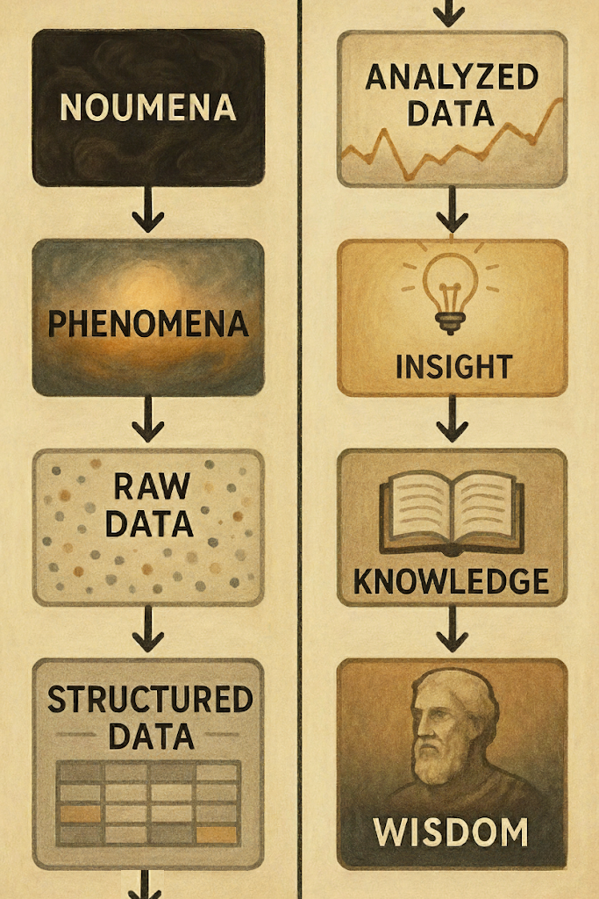

# Day 1 framing — "The score is never the meaning"
## Introducing the noumena → wisdom pipeline

*A student-facing passage (lecture script or short reading) for **Day 1 / ML0**, introducing
`images/noumena_to_wisdom_pipeline.png` as the course's through-line. Revisit one arrow per unit.
Plain language; no prior philosophy assumed. ~600 words.*

> Part of the course's intellectual architecture — full treatment in
> [`../planning/CONCEPTUAL_FRAMEWORK_2026.md`](../planning/CONCEPTUAL_FRAMEWORK_2026.md) (§1 the spine, §3 scale/vantage,
> §4 the moral floor + Auden). This passage is one drafted *student-facing* realization of §1.

---

**Before we write a single line of code, look at this diagram.**

Down the left side: **noumena → phenomena → raw data → structured data.** Down the right:
**analyzed data → insight → knowledge → wisdom.** It's a map of where everything we'll do this month
actually sits — and it begins much further from "the truth" than you'd guess.

Start at the top. *Noumena* is the philosopher Immanuel Kant's word for **the thing as it actually
is, in itself** — the whole, real, lived fact of something, independent of anyone perceiving it.
Kant's hard claim: we never get there. We don't experience the thing-in-itself; we only ever get the
**phenomenon** — the thing *as it appears to us*, already filtered through our senses, our language,
our attention.

Make it concrete with our own data. A woman in Texas reads that her child's classroom will display
the Ten Commandments, and she feels something — a knot of conviction, memory, fear, faith, anger.
That feeling, whole and hers, is the **noumenon.** We will never have it. What we can have is what she
*typed*: a YouTube comment. That comment is already a **phenomenon** — a lossy, public projection of
an inner state, shaped by what she was willing to say, in the words available to her, in a box on a
screen.

And we don't even start there. By the time that comment reaches your notebook it has been **scraped**
(*raw data* — and already some comments were missed, some split in half), **cleaned and tabulated**
(*structured data* — you chose which words to delete, what counts as a "word," what counts as a row),
**run through a model** (*analyzed data* — VADER decided "great" means positive; you asked for four
topics), and only *then* do you reach for **insight, knowledge,** and — maybe, by the end — **wisdom.**

Here is the point to carry all month: **every arrow on this diagram is a human decision.** Not a
neutral pipe — a choice, with a person and a value behind it. Whose comments did we collect? Which
words did we throw away? Where did we draw the line between "positive" and "negative"? How many topics
did we ask the model to find? Each arrow is a place where someone's judgment enters the data.

It's tempting to call that *contamination* — as if a clean, true signal up top got dirtied on the way
down. But look again at what the diagram says: **there is no clean signal up top.** We never had the
noumenon. The very first step is already an interpretation, and every step inherits all the choices
before it. So bias doesn't *sneak into* pure data. **Bias is the material the data is made of.** That's
not cause for despair, and it's *not* a reason to distrust everything — it's the reason for the one
habit this course asks of you constantly: **make your choices visible.** Every time you delete a word,
set a threshold, or name a topic, you'll write a `#comment` saying what you did and why. The honest
move isn't pretending you found the truth; it's showing your work so someone else can see where you
stood.

We'll return to this diagram every week. Scraping data? We're at the **phenomena → raw** arrow. Picking
stopwords? **raw → structured.** Running sentiment? **structured → analyzed.** By your final reflection
you'll be standing in the bottom-right corner — and the question won't be "did you get the right
answer?" It will be **"do you understand everything you chose along the way?"**

That's what the right half of the diagram is about, and it's why this course doesn't grade you on clean
code. **Insight, knowledge, wisdom** aren't outputs you can compute. They're what's left after you've
been honest about every arrow above them.

---

### Teaching notes
- **Per-unit callback** (the payoff of introducing it Day 1): name the active arrow at the top of each
  relevant session — Day 8 collection = *phenomena→raw*; HW2 stopwords = *raw→structured*; HW3 VADER +
  the 0.05 cutoff = *structured→analyzed*; HW4 "human names the topics" = *analyzed→insight*; the
  reflections = the climb to *knowledge/wisdom*. Full per-arrow map: `images/README.md`.
- **Vocabulary dial (open decision).** The passage uses "noumena/phenomena" explicitly. If that reads
  as too much Kant for this audience, swap in "the thing itself / the thing as it appears" and keep the
  diagram — the *argument* survives without the terms.
- **The score is never the meaning** is the one-line version; good as a recurring refrain.
- Pairs naturally with **ML9 "Going Public"** at the end (analysis → public argument = the climb into
  the right column) and with the **close-vs-distant reading** hinge (Day 7).
